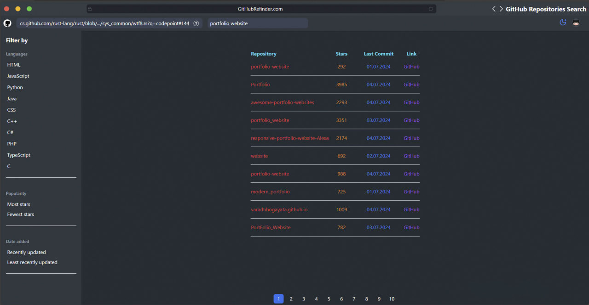

# GitHubRefinder 
GitHubRefinder is a platform designed to help users easily find repositories on GitHub and provides users with convenient tools to filter and view information about found projects



## Navigation
1. [Features](#features) ✨

2. [Stack](#stack) 🛠️

3. [Quick Start](#quick-start) 🚀

## Features
- **Advanced Filtering Options:** Filter repositories by popularity, programming languages, and date added to find exactly what you're looking for.
- **Repository Details Page:** Click on a repository to view detailed information about it, including description, stars, forks, and more.
- **Direct GitHub Access:** Easily navigate to the repository's GitHub page to explore it further, contribute, or clone the project.
- And many more, including code architecture and reusability.

## Stack 🛠️
- React.js
- TypeScript
- Tailwind CSS
- Node.js
- GraphQL
- Zustand
- Vite

## Quick Start 🚀
Follow these steps to set up the project locally on your machine.

### Prerequisites

Make sure you have the following installed on your machine:

- [Git](https://git-scm.com/downloads)
- [Node.js](https://nodejs.org/en)
- [npm](https://www.npmjs.com/) (Node Package Manager)


**Cloning the Repository**

```sh
git clone https://github.com/avariceJS/GitHubRefinder.git
cd GitHubRefinder
```

**Installation**

Install the project dependencies using npm:

```
npm install
```

**Running the Project**
```
npm run dev
```

Open http://localhost:5173 in your browser to view the project.